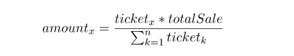

# Welcome to [AptosPad](https://aptospad.app)


ApptosPad is the launchpad platform on Aptos blockchain that accelerates the future ideals by connecting the community, investors and builders. The creative ideals can become real with the fundraising and support from AptosPad platform

AptosPad is the DAO and community-driven platform so that It creates the fair opportunity for any users to access the project's token sale from the early stage.

Project resources:

[Smart contract](https://github/aptospad-app/smart-contracts)

[Web application](https://aptospad.app)

[Discord Channel](https://discord/) | [Twitter](https://twitter.com/)

[Contact us](mailto:contact@aptpospad.app)

## How AptosPad work

__AptosPad__ is the launchpad platform that helps the projects raise funds from the early stage. All fundraising is in the token (or coin) on Aptos blockchain. 

Projects that are listed on AptosPad must be qualified and verified by platform experts or through community voting process. All projects must publish the following information: 
- Project name and description 
- Project purpose, the problem solving 
- Website, media channel (discord, telegram, twitter …)
- Founder team  
- Whitepaper and source code (if open source)
- Fundraising target/hardcap, policy and refund terms/conditions

As supporters/investors, you can check for the project information, the potential and decide whether or not to participate in the token sales.

## The AptosPad functions
Like many other launchpad platforms, Aptos Pad has the following functions 
- Register new projects for early public sales
- List of current projects in sale progress and projects in the past
- Register users/investors by web2 or web3 methods
- KYC project owners/investors 
- Whitelist users for specific projects
- Buy early sales tokens and claim 
- Earn reward by Staking and farming 
- Daily task and leaderboard ranking 
- Earning by inviting/ref
- Voting for projects
- Other functions

## How to participate in token sales
Normally, token sale of projects listed on AptosPad is in the early stage (like the public IDO) and the amount of token is limited (3-5% of total supply). Token price is expected to increase several times in the next public sales on exchanges, that’s why not everyone can buy the token on platform. The project owner may restrict the sales and bring the opportunity to users who help the project in the long-term vision. To make It fair for every user to access the early sales, AptosPad has the ticket-based and whitelist mechanism. Users in the whitelist will have the opportunity to get the ticket and buy the project token.

### Whitelist mechanism 

Users that hold and stake the ATPP token in a staking pool at least 3 days before the token sale occurs will get the ticket. The number of tickets depends on the ATPP token that users deposit into the staking pool and the amount of project token will be based on the number of tickets that users have.
 ``` number_of_ticket = floor(APTT/1000) + reward``` where  ```reward = floor(APTT/5000)``` 
. That means users get 1 ticket for each 1000 APTT staking token and get another 1 ticket for each other 5000 APTT staking token. For example :
- If user stake 2000 APTT, they get ```floor(2000/1000) = 2 tickets```
- If user stake 7000 APTT, they get ```floor(7000/1000) + floor(7000/5000) = 9 tickets``` 
- If users stake 60.000 APTT, they get ```floor(60000/1000) + floor(60000/5000) = 60 + 12 = 72 tickets```

Please note that the official ticket calculation will be define in smart contract at the time of deploying

### AptosPad ticket.
AptosPad ticket is the fair way for users participating in the early token sale. To get the Aptospad tickets users can join the whitelist by taking the ATPP token which is described in the session above or participate in community activities on the platform such as share the event, retweet the post, win the lottery, … the first 100 users with the high ranking will get the tickets. The number of tickets that the leaderboard can archive will depend on the situation when launching the projects.

The token that a user will be allowed to by will be calculated by the formulation below:



Where:
- _amount(x)_: is the amount of token that user X can buy
- _ticket(x)_: is the number of tickets that user X has
- _totalSale_: is the total token of project in the early sale
- _sum of ticket(k)_: is the total tickets on the platform joined the early sale

Please note that the token that user X can buy will not exceed the maximum quota that a user can buy defined in each project policy

## ATPP - The utinity token on AptosPad
ATPP is the token/coin of AptosPad on Aptos blockchain that is designed to leverage the AptosPad ecosystem
### Token utinity
With APTT token/coin, users can:
- Get more opportunity to participate in early sale of any projects 
- Stake to add to whitelist, get ticket and buy tokens 
- Earn reward from staking tools 
- Vote for projects to be listed or delisted 
- Swap/exchange to another token 

### Tokenomic
There will be 1.000.000.000 (1B in word) token issued on Aptos mainet. The allocation and vesting schedule as following (draft)

| Token distribution           | Percentage  | Amount     | Vesting schedule                              |
| -----------------------      | ----------- |------------|-----------------------------------------------|
| Private round                | 8 %         |80.000.000  |Release 20% at TGE, linear vesting in 6 months |
| Public round (IDO)           | 4%          |40.000.000  |Release 100% at TGE                            |
| Advisor                      | 5%          |50.000.000  |Release 10% at TGE, linear vesting in the next 36 months|
| Founder/Core team            | 15%         |150.000.000 |Fully lock in 12 months then unlock over 36 months|
| OG, community, airdrop       | 50%         |500.000.000 |Release on each campain, target in 5 years|
| Treasury                     | 18%         |180.000.000 |Fully lock in the first 3 years, unlock over next 36 months|

## Become the early supporter
The early supporters, also known as __OG__ will have the high opportunity to buy the tokens because they will have the priority tickets (without staking the APTT token) to access the project sales.
There are many ways to become early supporters (or OG) such as joining and sharing AptosPad social media channels, partnership or collaboration in projects … There will be a post on twitter of how to be the platform early supporters. Please follow us [AptosPad](https://twitter.com/Aptospad_DAO)


<!--

**Here are some ideas to get you started:**

🙋‍♀️ A short introduction - what is your organization all about?
🌈 Contribution guidelines - how can the community get involved?
👩‍💻 Useful resources - where can the community find your docs? Is there anything else the community should know?
🍿 Fun facts - what does your team eat for breakfast?
🧙 Remember, you can do mighty things with the power of [Markdown](https://docs.github.com/github/writing-on-github/getting-started-with-writing-and-formatting-on-github/basic-writing-and-formatting-syntax)
-->
